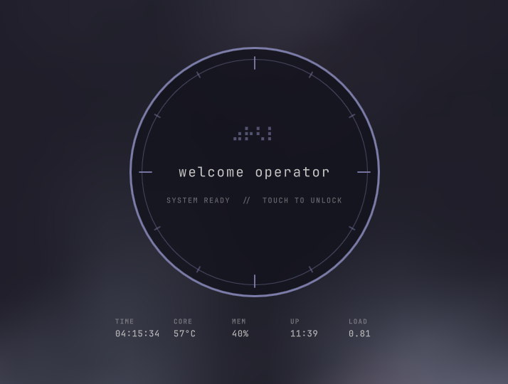

# LockSigil

A Quickshell session lock screen for [Omarchy](https://omarchy.org/), forked
from the built-in `omarchy.lock`. It keeps Omarchy's separate password and
fingerprint PAM flows but replaces the interface with a circular, sci-fi
instrument-panel design that greets you when you leave — and welcomes you back
when you return.



## Features

- **Says goodbye, then hello** — the screen bids you farewell with "bye
  &lt;name&gt;" as it locks, then greets "welcome &lt;name&gt;" when you come back
  from sleep, suspend, or a blanked display.
- **Two PAM flows** — password auth via `omarchy-lock-password`, and
  fingerprint auth via `omarchy-lock-fingerprint` when fprintd reports an
  enrolled finger.
- **Animated instrument panel** — a circular control dial with concentric
  signal rings, ticking tick marks, and a braille "noise" loader that shimmers
  like live static. Any key or click folds the whole dial fluidly into the
  password field.
- **Live telemetry HUD** — the idle screen keeps an eye on your machine: time,
  CPU core temperature, memory usage, uptime, and load average.
- **Password entry** — any key or click folds the circular interface into the
  password field without losing the first keystroke. Long passwords shrink
  the masked dots so they never clip.
- **Fingerprint hint** — an icon sits inside the field's right edge when a
  sensor is enrolled, matching hyprlock's placement.
- **Display blanking** — after 30 seconds of idle input the display is blanked
  via `omarchy-brightness-*`; any input wakes it with a "welcome" greeting.
- **Stranded-lock recovery** — adopts an orphaned session lock left behind
  after a shell restart, as long as the PAM config is present.

## Requirements

- Omarchy (uses `omarchy-system-wake`, `omarchy-brightness-*`, and
  `omarchy-hyprland-session-locked`).
- `/etc/pam.d/omarchy-lock-password` — without it, the lock refuses to start.
- (Optional) `/etc/pam.d/omarchy-lock-fingerprint` plus `fprintd` for
  fingerprint unlock.

## Install

```bash
omarchy plugin add https://github.com/burninc0de/burninc0de.lock.git --enable
```

Installing switches the shell from `omarchy.lock` to this plugin (the manifest
declares `clonedFrom: omarchy.lock`, so the built-in is disabled in your
`shell.json`). The plugin id is `burninc0de.lock` and lives at
`~/.config/omarchy/plugins/burninc0de.lock/`.

## Removal

```bash
omarchy plugin remove burninc0de.lock --yes
```

This disables the plugin, removes its folder under
`~/.config/omarchy/plugins/`, and — because the manifest declares
`clonedFrom: omarchy.lock` — re-enables Omarchy's built-in lock screen.

## Commands

| IPC target | Function | Purpose |
|-----------|----------|---------|
| `lock` | `lock` | Lock the session (`ok` / `missing-pam` / `failed`) |
| `lock` | `isLocked` | `true` / `false` |
| `lock` | `status` | JSON snapshot of lock state |
| `lock` | `preview` / `hidePreview` | Show / hide the lock preview overlay |

## License

[MIT](LICENSE)
